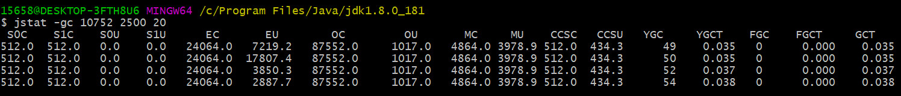
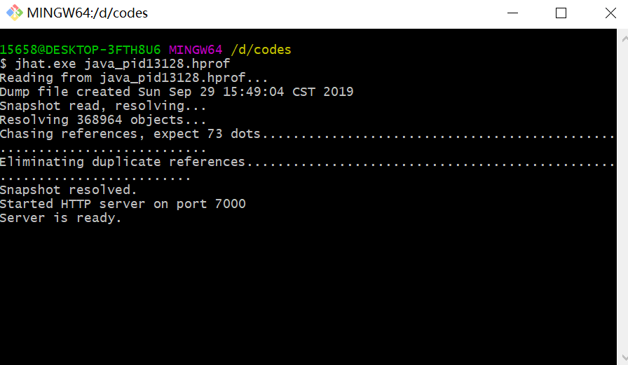
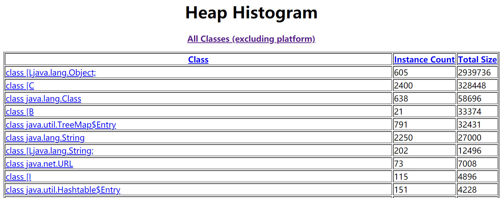
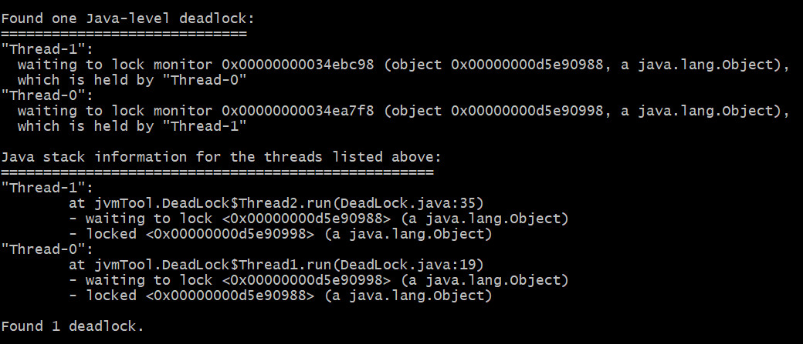

# 虚拟机性能监控与故障处理

给一个系统定位问题的时候，知识、经验是关键基础，数据是依据，工具是运动知识处理数据的手段

## JDK的命令行工具

1. jps 虚拟机进程状况工具
2. jstat 虚拟机统计信息监视工具
    

    * S0C：第一个幸存区的大小
    * S1C：第二个幸存区的大小
    * S0U：第一个幸存区的使用大小
    * S1U：第二个幸存区的使用大小
    * EC：伊甸园区的大小
    * EU：伊甸园区的使用大小
    * OC：老年代大小
    * OU：老年代使用大小
    * MC：方法区大小
    * MU：方法区使用大小
    * CCSC:压缩类空间大小
    * CCSU:压缩类空间使用大小
    * YGC：年轻代垃圾回收次数
    * YGCT：年轻代垃圾回收消耗时间
    * FGC：老年代垃圾回收次数
    * FGCT：老年代垃圾回收消耗时间
    * GCT：垃圾回收消耗总时间

3. jinfo Java配置信息工具
4. jmap Java内存映像工具 ->生成堆转储快照
5. jhat 虚拟机堆转栈快照分析工具

6. jstack Java堆栈跟踪工具

分析死锁
Found one Java-level deadLock:
有一个死锁
