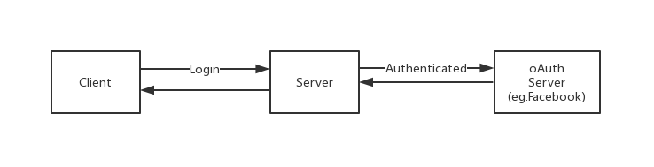
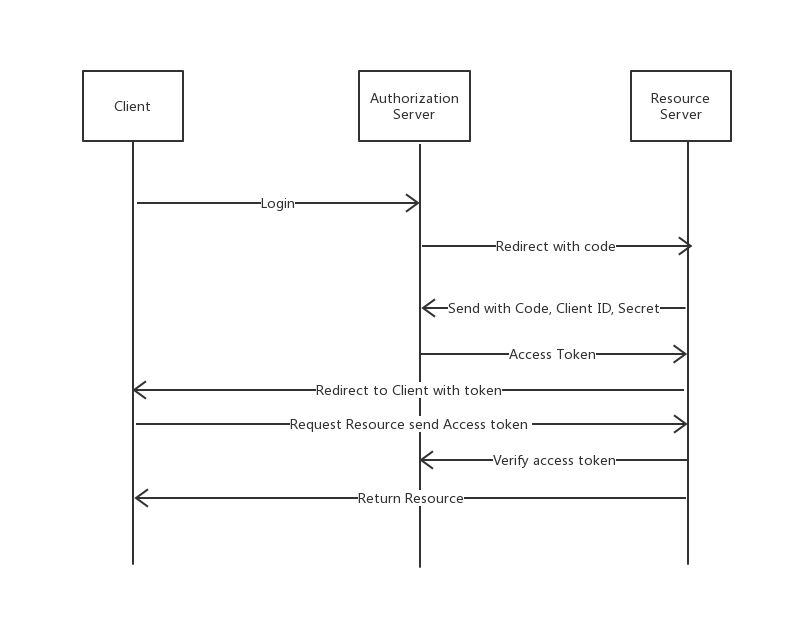
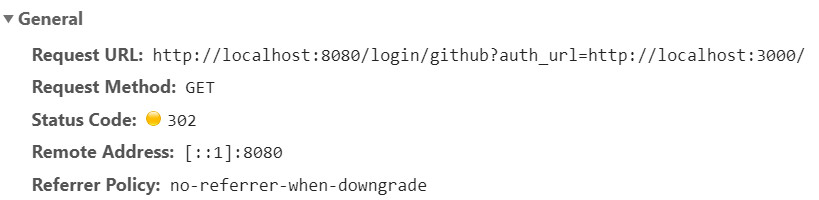
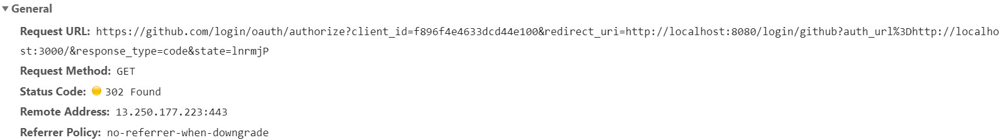
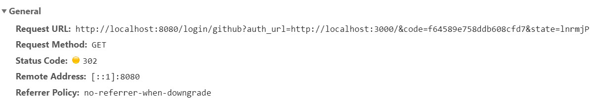
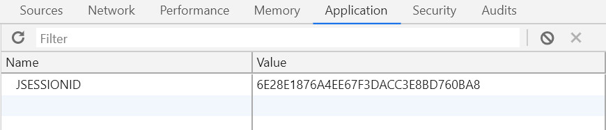

# Spring Boot and oAuth2

@Author ly

## Abstract

1. Spring Boot Security包含了oAuth的实现

2. oAuth是开放的网络授权标准协议，目前版本是2.0,oAuth2可以通过别的应用程序授权登录，从而实现single-sign-on单点登录。  

3. oAuth的登陆方式，本博客主要实现授权码模式：  

* 授权码模式 authorization_code
* 简化模式 implicit
* 用户密码模式 resource owner password credentials
* 客户端模式 client credentials

## Introduction

1. Spring Boot Security

2. oAuth 3种角色  
Resource Owner, Resource Server, Clien Application, Authorization server  

3. oAuth授权码模式详解
简单来说，就是两次认证，第一次认证拿code，第二次拿token。  
比如: 访问会给你发一个钥匙即code,需要拿这个code去看和门是否匹配(token)。


## Code & Results

**Step1**: 当用户点击login,会跳转到自定义的后台登陆接口(Spring Serurity自动生成)  
Request URL: http://localhost:8080/login/github?auth_url=http://localhost:3000/  
服务器http响应码：302，表示会重定向到oAuth的授权界面
  

**Step2**: 授权，返回code
Request URL: https://github.com/login/oauth/authorize?client_id=f896f4e4633dcd44e100&redirect_uri=http://localhost:8080/login/github?auth_url%3Dhttp://localhost:3000/&response_type=code&state=IQED5P
服务器http响应码：302，表示会重定向到resource server


**Step3**：获取code
Request URL: http://localhost:8080/login/github?auth_url=http://localhost:3000/&code=3bc620a19f0f0029282c&state=IQED5P  


**Step4**: 后台直接发出请求拿到token




## Discussion

### 跨域

1. 浏览器的同源策略  
协议+域名+端口

2. 同源策略限制：  
1.) Cookie、LocalStorage 和 IndexDB 无法读取  
2.) DOM 和 Js对象无法获得  
3.) AJAX 请求不能发送  

3. 解决跨域问题
本文使用Axios封装的跨域资源共享CROS  
前后端都需要设置字段:Access-Control-Allow-Origin

```java
response.setHeader("Access-Control-Allow-Origin", "http://localhost:3000");
response.setHeader("Access-Control-Allow-Methods", "GET,POST,DELETE,PUT,OPTIONS");
response.setHeader("Access-Control-Allow-Headers", "access-control-allow-origin");
response.setHeader("Access-Control-Allow-Credentials", "true");
response.setHeader("Access-Control-Max-Age", "3600");
```
