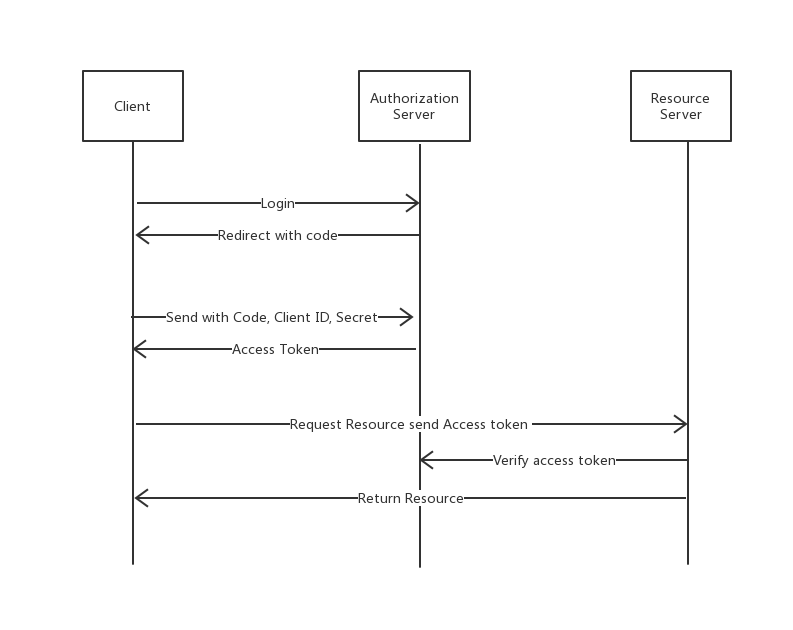

# Spring Boot and oAuth2

@Author ly

## Abstract

1. Spring Boot Security包含了oAuth的实现

2. oAuth是开放的网络授权标准协议，目前版本是2.0,oAuth2可以通过别的应用程序授权登录，从而实现single-sign-on单点登录。

3. oAuth的登陆方式，本博客主要实现授权码模式：  

* 授权码模式 authorization_code
* 简化模式 implicit
* 用户密码模式 resource owner password credentials
* 客户端模式 client credentials

## Introduction

1. Spring Boot Security

2. oAuth 3种角色  
Resource Owner, Resource Server, Clien Application, Authorization server  

3. oAuth授权码模式详解
简单来说，就是两次认证，第一次认证拿code，第二次拿token。  
比如: 访问会给你发一个钥匙即code,需要拿这个code去看和门是否匹配(token)。

## Code & Results

## Discussion

### 跨域

1. 浏览器的同源策略
2. 跨域问题
3. 解决跨域问题
