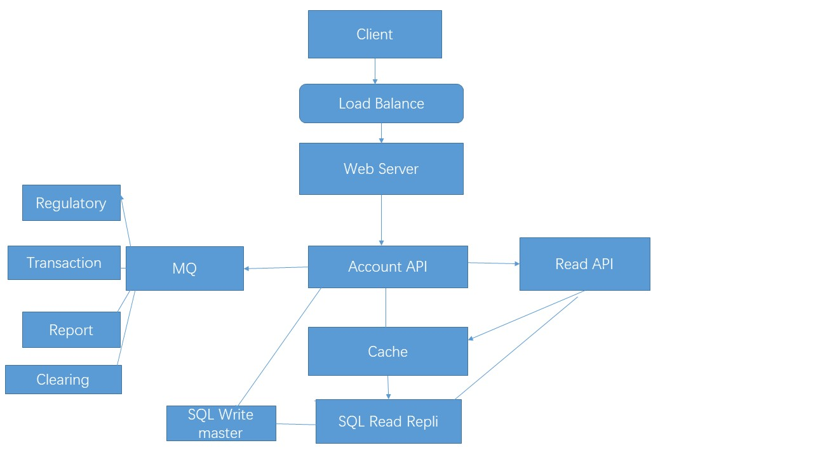

# 设计Ticket-Blotter

## Step1: 概述用例和约束

### 概述用例：

1. user(trader/sales)能够连接上交易系统账号

2. 进行交易

* 进行搜索，修改，清算和电子确认等操作

3. 设置监管规则

* 手动设置忽略监管规则

* 不合规的地方发送通知

4. 生成各类报表

5. 系统具有高并发高可用性

### 约束：

1. 流量分布不均

2. 添加或删除交易系统账号较少

3. 报表不需要实时更新

4. 百万个用户

5. 每月300万笔交易

6. 每月3000万次读取

7. 读写比例10：1，有大量写入，但是每天比较少访问该网站

### 预计增量

平均每秒2,000个事务
平均每秒200个读取请求

## Step2：创建高级设计


## Step3: 设计核心组件

1. 用户连接到交易系统账户

将有关百万个账号存放到关系型数据库

Q:为什么选择关系型数据库而不是NoSQL  
A:关系型数据库：索引查询特别快，结构型数据，严格的Scheme, 需要复杂的联结操作，事务
  NoSQL: 存储的Scheme多样，不需要复杂的联结操作，存储TB级别数据，高吞吐量
  因为我们这里数据量不是很大，并且格式统一，因此选用关系型数据库

表的设计：

create table User (
    id int NOT NULL AUTO_INCRECEMENT,
    user_id varchar(255) NOT NULL,
    account_login varchar(255) NOT NULL,
    account_password varchar(255) NOT NULL,
    primary key(id),
    last_update datetime NOT NULL
)

公共API:

```java
$ curl -X POST --data '{ "user_id": "foo", 
    "account_login": "baz", "account_password": "qux" }' \
    https://ticketblotter.com/api/v1/account
```

内部通信，使用RPC(Remote Procedure Call, 远程服务调用) -》还不太懂

2. 在该账户下做修改，清算和确认等操作

* 用户连接账户

* 系统自动刷新账户

* 进行一系列操作

数据流： 

* Web端发送请求到服务器

* 服务器将请求转发到Account service

* 账号服务器放一个MQ，使用队列异步

* Regulatory Service: 从MQ拉取数据，做监管，判断交易是否合规

* Report Service：生成报表

* Clearing Service: 清算

* Transaction Service: 从MQ拉取数据进行交易

#### 监管实现

```java
public enum TicketFeedSystem {
  HK, LN, NY, TK
}
```

```java
Regulatory_map
HK: return map_data(HK)
LN: return map_data(LN)
...
```

## Step4: Scale the design



测试：1）基准测试/负载测试  2）瓶颈的概要文件  3）在评估替代方案和折中方案时解决瓶颈  4）重复

细节问题： 如，设置几个负载均衡器，主从副本


