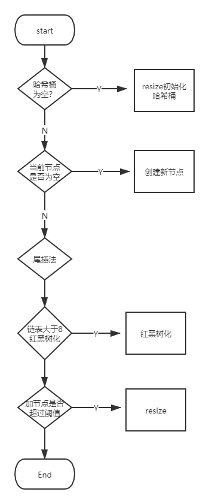

# 面经

## 自我介绍&项目介绍

在工作将近两年时间内，主要做了两个项目：

1. TPS, TPS是一个固定收益类金融衍生品的大型交易系统，我主要负责监管这一块。

* 业务flow就是从客户端或者一些webService发送请求到TPS API, API将请求发送至消息中间件EMS集群，EMS负载均衡到各个service,我主要做的是监管的svc,发送到下游并将数据存储至数据库。

* 我平时的工作就是独立完成需求分析，开发，测试并独立部署。同时基于缓存搭建了一个配置中心，提升用户体验。

2. Equity，Equity是一个股票类金融衍生品的系统，我负责blotter这块。

* 我平时的工作出去日常独立工作，主要做了以下四个工作：

1）通过ELK+filebeat搭建日志查看平台，提升开发效率  
2）用oAuth2实现sso单点登录，统一后端认证，提升用户体验  
3）优化日常CI/CD流程，优化开发流程  
4）单体应用转换到webService，目前在系统设计阶段  

个人技能：算法，Java，系统设计，数据库，框架

想来**的理由：

1）现在这个业务场景比较复杂，我在平时工作中比较喜欢解决复杂的问题，想去接受挑战
2）想在技术上继续钻研并且技术落地，目前来说**技术很新，希望自己能有机会去接触
3）目前**发展前景很好，大势所趋

## 面试问题

[java基础](#java基础)

* [Object类](#Object类：对于所有对象通用的方法)

    * [equals方法](#equals)

    * [hashCode方法](#hashCode方法)

    * [toString方法](#toString)

    * [clone方法](#clone)

* [HashMap](#HashMap)

    * [能不能说一下hashMap的Put操作和resize操作](#hash算法和扩容机制)

    * [能不能说一下为什么hashMap是用红黑树而不是AVL树](hashMap用红黑树的理由)

    * [不用头插法的理由？]()
    
    * [说一下concurrentHashMap的原理，为什么不是用hashTable]()

    * [为什么concurrentHashMap没有用sync或者Lock去保证线程安全呢？说一下sync的锁升级过程]()

* [并发](#并发)

    * [volatile关键字](#volatile关键字)

    * [线程池](#线程池)

* [jvm](#jvm)

* [框架](#Spring)

    * [BeanFactory和ApplicationContext的区别](#BeanFactory和ApplicationContext)

    * [Spring IoC启动过程](#IoC启动过程)


## java基础

## Object类：对于所有对象通用的方法

```java
public native int hashCode();
public boolean equals(Object o) {return thi s == o;}
public String toString() {
    return getClass.getName + "@" + Integer.toHexString(hashCode());
}
protected native Object clone() throws CloneNotSupportedException;


```

## equals

默认所有类都要继承equals()方法

```java
    //在没有重写hashCode方法和equals方法的情况下，比较的是栈中的引用
     * The {@code equals} method implements an equivalence relation
     * on non-null object references:
     reflexive（自反性），传递性，对称性，一致性，非null与null进行比较，返回false
```

Integer, String, Boolean, Double等封装类型都会重写equals方法。  
基本类型用==去判断值是否相等，没有equals方法。  
比较经典的是String的equals方法：

```java
public boolean equals(Object anObject) {
    if (this == anObject) return true;
    if (anObject instanceof String) {
        String anotherObject = (String)anObject;
        int n = value.length;
        if (n == anotherObject.length) {
            char[] c1 = value;
            char[] c2 = anotherObject.value;
            int i = 0;
            while (n-- != 0) {
                if (c1[i++] != c2[i++]) return false;
            }
            return true;
        }
    }
    return false;
}
```

ps:在《Effective Java》中，*覆盖equals总需要覆盖hashCode方法*

## hashCode方法

```java
    //hashCode方法返回一个hash int值，一般用在hashMap, hashTable, hashSet里
     * Returns a hash code value for the object. This method is
     * supported for the benefit of hash tables such as those provided by
     * {@link java.util.HashMap}.
    //在应用程序执行过程中，当调用同一个object多次，会返回同一个整数；如果多个应用程序执行，可以不一致
     * <li>Whenever it is invoked on the same object more than once during
     *     an execution of a Java application, the {@code hashCode} method
     *     must consistently return the same integer, provided no information
     *     used in {@code equals} comparisons on the object is modified.
     *     This integer need not remain consistent from one execution of an
     *     application to another execution of the same application. 
    //如果两个Object调用equals方法为true，那么他们的hashCode是相同的整数结果
     * <li>If two objects are equal according to the {@code equals(Object)}
     *     method, then calling the {@code hashCode} method on each of
     *     the two objects must produce the same integer result.
    //如果两个objects不相同，那么不一定需要两个Objects产生不同的整数
     * <li>It is <em>not</em> required that if two objects are unequal
     *     according to the {@link java.lang.Object#equals(java.lang.Object)}
     *     method, then calling the {@code hashCode} method on each of the
     *     two objects must produce distinct integer results.  However, the
     *     programmer should be aware that producing distinct integer results
     *     for unequal objects may improve the performance of hash tables.
```

如果没有覆盖hashCode:

```java
public class Test {

    private static class Person {
        String name;
        int age;
        public Person(String name, int age) {
            this.name = name;
            this.age = age;
        }

        public String toString() {
            return "name" + name + "age" + age;
        }
        @Override
        public boolean equals(Object obj) {
            if (obj == null) return false;
            if (this == obj) return true;
            if (this.getClass() != obj.getClass()) return false;
            Person person = (Person)obj;
            return this.name.equals(person.name) && this.age == person.age;
        }
    }
    public static void main(String[] args) {
        Person p1 = new Person("Jenny", 11);
        Person p2 = new Person("Jenny", 11);
        Set<Person> hashSet = new HashSet<>();
        hashSet.add(p1);
        hashSet.add(p2);
        System.out.println(hashSet.size());
    }
}
```

上面代码输出为2，原因就是hashCode不一样，违反了hashCode方法的第二条：如果满足equals，那么hashCode也一样

```java
@Override
public int hashCode() {
    int result = 17;
    result = 31 * result + x;
    result = 31 * result + y;
    result = 31 * result + z;
    return result;
}
```

## toString

```java
//返回一个object
* Returns a string representation of the object.
public String toString() {
    return getClass().getName() + "@" + Integer.toHexString(hashCode());
}
```

```java
public class Test {
    public static void main(String[] args) {
        Test test = new Test();
        System.out.println(test.toString());
    }
}
```

## clone （还没有搞懂，Cloneable接口，浅拷贝，深拷贝）

```java
//是protected,不是Public
protected native Object clone() throws CloneNotSupportedException;
```

## HashMap

## hashMap的结构(数组table + 链表 + 红黑树)

哈希桶数组，Node数组

```java
transient Node<K,V>[] table;
static class Node<K, V> implements Map.Entry<K,V>{
    final int hash;
    final K key;
    V value;
    Node<K, V> next;
     ...getKey(), getValue(), toString(), hashCode(), equals(), setValue()...
}
```

## hash算法和扩容机制

hashMap是用散列表实现的，hashMap用的是拉链法，尾插法。如果哈希桶比较大，那么较差的hash算法也可以尽量均匀散列，但是空间成本大。在空间成本和时间成本中权衡，那么减少hash碰撞的关键：hash算法和扩容机制。

哈希桶初始化（数组长度，链表红黑树长度，负载因子，扩容长度）

```java
static final int DEFAULT_INITIAL_CAPACITY = 1 << 4;
static final int MAXIMUM_CAPACITY = 1 << 30;
static final float DEFAULT_LOAD_FACTOR = 0.75f;
static final int TREEIFY_THRESHOLD = 8;
```

## hash算法

好的散列函数应该满足简单均匀散列假设。理应来说，取模应该避免2的幂次方，因为会造成频率较高的哈希碰撞，但是在扩容和hash算法之间权衡，这里通过高位运算和与运算进行速度和效率的优化。

```java
//1.取哈希值 2. 高位运算 3. 取模
static final int hash(Object key) {
    int h;
    return (key == null) ? 0 : key.hashCode() ^ (h >>> 16);
}
static int indexFor(int h, int length) {  
    //jdk1.7的源码，jdk1.8没有这个方法，但是实现原理一样的
     return h & (length-1);
}
```

## put



```java
final V putVal(int hash, K key, V value, boolean onlyIfAbsent,
                   boolean evict) {
        Node<K,V>[] tab; Node<K,V> p; int n, i;
        //判断哈希桶是不是为空，如果为空将哈希桶初始化
        if ((tab = table) == null || (n = tab.length) == 0)
            n = (tab = resize()).length;
        //哈希桶该index是否为空，如果为空新建节点
        if ((p = tab[i = (n - 1) & hash]) == null)
            tab[i] = newNode(hash, key, value, null);
        else {
            Node<K,V> e; K k;
            //比较第一个元素，如果相同，将p赋值给e，用e记录
            if (p.hash == hash &&
                ((k = p.key) == key || (key != null && key.equals(k))))
                e = p;
            //判断是不是红黑树
            else if (p instanceof TreeNode)
                e = ((TreeNode<K,V>)p).putTreeVal(this, tab, hash, key, value);
            else {
                //遍历链表
                for (int binCount = 0; ; ++binCount) {
                    if ((e = p.next) == null) {
                        p.next = newNode(hash, key, value, null);
                        //链表长度超过8红黑树化
                        if (binCount >= TREEIFY_THRESHOLD - 1) // -1 for 1st
                            treeifyBin(tab, hash);
                        break;
                    }
                    if (e.hash == hash &&
                        ((k = e.key) == key || (key != null && key.equals(k))))
                        break;
                    p = e;
                }
            }
            if (e != null) { // existing mapping for key
                V oldValue = e.value;
                if (!onlyIfAbsent || oldValue == null)
                    e.value = value;
                afterNodeAccess(e);
                return oldValue;
            }
        }
        ++modCount;
        //threshold=capacity * loadfactor，如果超过阈值，那么resize
        if (++size > threshold)
            resize();
        afterNodeInsertion(evict);
        return null;
    }
```

## resize操作

因为jdk 1.7和1.8思想差别不太多，目前用1.7解释  
总体思路：判断旧的数组有没有>=阈值，如果是，那么不再resize;如果不是，那么将哈希桶的数量扩大为原来的两倍，将旧的哈希桶rehash到新的hash桶


```java
void resize(int capacity) {
    Entry[] oldTable = table;
    int oldcapacity = oldTable.length;
    if (oldcapacity >= MAXIMUM_CAPACITY) {
        threadhold = Integer.MAX_VALUE;
        return;
    }
    Entry[] newTable = new Entry[newcapacity];
    transfer(newTable);
    table = newTable;
    threadhold = (int)newcapacity * load_factor;
}
```

transfer方法

```java
void transfer(Entry[] newTable) {
    Entry[] src = table;
    int newcapacity = newTable.length;
    for (int i = 0; i < src.length; i++) {
        Entry<K, V> e = src[i];
        if (e != null) {
            src[i] = null;
            do {
                Entry<K, V> next = e.next;
                int i = indexFor (e.hash, newcapacity);
                e.next = newTable[i];
                newTable[i] = e;
                e = next; //采用头插法
            } while (e != null)
        }
    }
}
```

在jdk1.8中，比较精妙的方法是rehash的方法，不再需要通过每个值重新rehash，而是记录高低位，去将原来哈希碰撞的Node均匀散布。

```java
                        Node<K,V> loHead = null, loTail = null;
                        Node<K,V> hiHead = null, hiTail = null;
                        Node<K,V> next;
                        do {
                            next = e.next;
                            //注意这里是hash值与oldCap与运算，如果为0，那么还是在原来的Index上
                            if ((e.hash & oldCap) == 0) {
                                if (loTail == null)
                                    loHead = e;
                                else
                                    loTail.next = e;
                                loTail = e;
                            }
                            //如果不为0，那么重新rehash到(index + oldCap)
                            else {
                                if (hiTail == null)
                                    hiHead = e;
                                else
                                    hiTail.next = e;
                                hiTail = e;
                            }
                        } while ((e = next) != null);
                        if (loTail != null) {
                            loTail.next = null;
                            newTab[j] = loHead;
                        }
                        if (hiTail != null) {
                            hiTail.next = null;
                            newTab[j + oldCap] = hiHead;
                        }
```

## hashMap用红黑树的理由

hashMap不全部用红黑树的理由：红黑树的插入和删除成本高，对于<8节点的，在查找成本和操作成本中权衡，采用链表更好。  
hashMap不采用AVL树的理由：采用AVL树维稳成本更高。  

## 并发

**Q: volatile原理，volatile应用场景，有没有什么源码中用了volatile  
线程池：线程池参数，应用场景  
添加：AQS，lock**  

## volatile关键字

* 原理：  
step1:A线程将保存主内存副本的本地内存更新过的数据刷回主内存  
step2:刷回主内存的过程中，将使其他线程的本地内存保存该数据的内存地址无效，需要重新从主内存获取更新的数据  

* 应用场景

一个线程修改值需要其他线程同步可读，保证数据可见性。

Example：AtomicInteger类（原子性用CAS, volatile和Unsafe进行保证）。稍微解释一下原子性，原子性就是一旦开始不可中断。

```java
//初始化
private static final Unsafe unsafe = Unsafe.getUnsafe();
    private static final long valueOffset;

    static {
        try {
            //利用反射机制获取value的偏移量
            valueOffset = unsafe.objectFieldOffset
                (AtomicInteger.class.getDeclaredField("value"));
        } catch (Exception ex) { throw new Error(ex); }
    }
    //用volatile修饰value字段，保证数据可见性
    private volatile int value;
```

```java
    public final boolean compareAndSet(int expect, int update) {
        return unsafe.compareAndSwapInt(this, valueOffset, expect, update);
    }
```

## 线程池

**线程池应用场景还不太会**

源码分析：

线程池的创建

```java
//corePoolSize:线程池核心线程数量
//maximumPoolSize:线程池最大线程数
//keepAliveTime:当线程池线程数超过核心线程数，空余的线程最大存获时间
//unit:时间单位
//WorkQueue:存放任务的队列
//threadFactory:创建线程的工厂
//handler:超出线程范围和队列容量的任务的处理策略
    public ThreadPoolExecutor(int corePoolSize,
                              int maximumPoolSize,
                              long keepAliveTime,
                              TimeUnit unit,
                              BlockingQueue<Runnable> workQueue,
                              ThreadFactory threadFactory,
                              RejectedExecutionHandler handler) {
```

## jvm

**GC算法和GC收集器  
添加：类加载，双亲委托，对象创建过程**

GC收集算法：  
标记清除，标记整理，复制算法  
G1收集器：
G1收集器支持并行和并发，能充分利用多核、多CPU硬件优势；  
分代收集；  
用标记整理算法；
可预测的停顿；

## 框架:

## IOC 

优点：代码更为简洁，进一步解耦（能够更好的管理依赖），减少内存消耗（不需要重复创建对象）

## BeanFactory和ApplicationContext

BeanFactory是IoC容器定义的最底层接口，主要方法是：getBeat, isSingleton, isPrototype, getAliases  
ApplicationContext:高级接口，继承了ListableBeanFactory, HierarchicalBeanFactory等，功能更为拓展  

## IoC启动过程

1. 从ClassPathApplicationContext构造方法开始

```java
public ClassPathXmlApplicationContext(String[] configLocations, boolean refresh, @Nullable ApplicationContext parent) throws BeansException {
        super(parent);
        this.setConfigLocations(configLocations);
        if (refresh) {
            //refresh方法，将如果原来有的IoC容器销毁关闭，重新初始化IoC容器，对Bean载入
            this.refresh();
        }
    }
```

2. 对refresh方法怎么初始化IoC容器的有一个大概思路

```java
public void refresh() throws BeansException, IllegalStateException {
        synchronized(this.startupShutdownMonitor) {
            //prepare this context for refreshing：记录时间，改启动状态，处理配置文件的占位符等
            this.prepareRefresh();
            //tell the subclass to refresh the internal bean factory
            //obtainFreshBeanFactory:解析配置文件，beanDefinition去描述bean，并注册在ListableBeanFactory中
            ConfigurableListableBeanFactory beanFactory = this.obtainFreshBeanFactory();
            //prepare the bean factory for use in this context
            //设置beanFactory的类加载器，添加几个BeanPostProcessor，手动
            this.prepareBeanFactory(beanFactory);

            try {
                //allows post-processing of the bean factory in context subclasses
                this.postProcessBeanFactory(beanFactory);
                //Invoke factory processors registered as beans in the context
                this.invokeBeanFactoryPostProcessors(beanFactory);
                //Register bean processors that intercept bean creation
                this.registerBeanPostProcessors(beanFactory);
                //Initialize message source for this context
                this.initMessageSource();
                //Initialize event multicaster for this context
                this.initApplicationEventMulticaster();
                //Initialize other special beans in specific context subclasses
                this.onRefresh();
                //check for listener beans and register them
                this.registerListeners();
                //Instantiate all remaining (non-lazy-init) singletons
                this.finishBeanFactoryInitialization(beanFactory);
                //Last step: publish corresponding event
                this.finishRefresh();
            } catch (BeansException var9) {
                if (this.logger.isWarnEnabled()) {
                    this.logger.warn("Exception encountered during context initialization - cancelling refresh attempt: " + var9);
                }

                this.destroyBeans();
                this.cancelRefresh(var9);
                throw var9;
            } finally {
                this.resetCommonCaches();
            }

        }
    }
```

其中prepare工作：

```java
```java
protected void prepareRefresh() {
        this.startupDate = System.currentTimeMillis();
        this.closed.set(false);
        this.active.set(true);
        if (this.logger.isDebugEnabled()) {
            if (this.logger.isTraceEnabled()) {
                this.logger.trace("Refreshing " + this);
            } else {
                this.logger.debug("Refreshing " + this.getDisplayName());
            }
        }

        this.initPropertySources();
        this.getEnvironment().validateRequiredProperties();
        if (this.earlyApplicationListeners == null) {
            this.earlyApplicationListeners = new LinkedHashSet(this.applicationListeners);
        } else {
            this.applicationListeners.clear();
            this.applicationListeners.addAll(this.earlyApplicationListeners);
        }

        this.earlyApplicationEvents = new LinkedHashSet();
    }
```
```

3. 详细解释一下上面步骤

Step 1: 资源的定位

```java
public ClassPathXmlApplicationContext(String[] configLocations, boolean refresh, @Nullable ApplicationContext parent) throws BeansException {
        super(parent);
        //资源定位
        this.setConfigLocations(configLocations);
        if (refresh) {
            this.refresh();
        }
```

Step2: obtainFreshBeanFactor:资源加载 IoC初始化并将资源加载到ListableBeanFactory中

```java
    protected ConfigurableListableBeanFactory obtainFreshBeanFactory() {
        this.refreshBeanFactory();
        return this.getBeanFactory();
    }
```

```java
protected final void refreshBeanFactory() throws BeansException {
    //如果已经存在beanFactory，那么销毁并关闭
        if (this.hasBeanFactory()) {
            this.destroyBeans();
            this.closeBeanFactory();
        }

        try {
            //创建一个beanFactory，并加载BeanDefiniton
            DefaultListableBeanFactory beanFactory = this.createBeanFactory();
            beanFactory.setSerializationId(this.getId());
            this.customizeBeanFactory(beanFactory);
            //将beanDefinition装载在beanFactory中
            this.loadBeanDefinitions(beanFactory);
            synchronized(this.beanFactoryMonitor) {
                this.beanFactory = beanFactory;
            }
        } catch (IOException var5) {
            throw new ApplicationContextException("I/O error parsing bean definition source for " + this.getDisplayName(), var5);
        }
    }
```

Step 3：资源注册，将读取到的resource转换成beanDefinition，其中真正执行的方法是doLoadBeanDefinition

```java
protected int doLoadBeanDefinitions(InputSource inputSource, Resource resource) throws BeanDefinitionStoreException {
        try {
            //将xml转换成DOM对象
            Document doc = this.doLoadDocument(inputSource, resource);
            //将DOM转换成Spring能够识别的数据结构BeanDefinition
            int count = this.registerBeanDefinitions(doc, resource);
            if (this.logger.isDebugEnabled()) {
                this.logger.debug("Loaded " + count + " bean definitions from " + resource);
            }

            return count;
        } catch (BeanDefinitionStoreException var5) {
            throw var5;
        } catch (SAXParseException var6) {
            throw new XmlBeanDefinitionStoreException(resource.getDescription(), "Line " + var6.getLineNumber() + " in XML document from " + resource + " is invalid", var6);
        } catch (SAXException var7) {
            throw new XmlBeanDefinitionStoreException(resource.getDescription(), "XML document from " + resource + " is invalid", var7);
        } catch (ParserConfigurationException var8) {
            throw new BeanDefinitionStoreException(resource.getDescription(), "Parser configuration exception parsing XML from " + resource, var8);
        } catch (IOException var9) {
            throw new BeanDefinitionStoreException(resource.getDescription(), "IOException parsing XML document from " + resource, var9);
        } catch (Throwable var10) {
            throw new BeanDefinitionStoreException(resource.getDescription(), "Unexpected exception parsing XML document from " + resource, var10);
        }
    }
```

继续看registerBeanDefinitions -> 把DOM树转换成Spring可识别的BeanDefinition

首先了解一下BeanDefinition  
BeanDefinition中保存了Bean信息，比如Bean名字，Class名，是不是懒加载，scope是singleton还是prototype等

```java
public interface BeanDefinition extends AttributeAccessor, BeanMetadataElement {
    String SCOPE_SINGLETON = "singleton";
    String SCOPE_PROTOTYPE = "prototype";
    int ROLE_APPLICATION = 0;
    int ROLE_SUPPORT = 1;
    int ROLE_INFRASTRUCTURE = 2;

    void setParentName(@Nullable String var1);

    @Nullable
    String getParentName();

    void setBeanClassName(@Nullable String var1);

    @Nullable
    String getBeanClassName();

    void setScope(@Nullable String var1);

    @Nullable
    String getScope();

    void setLazyInit(boolean var1);

    //懒加载：默认值为false,如果为true,那么只有当我们使用Spring IoC容器的getBean方法时获取，才会初始化，完成依赖注入。
    boolean isLazyInit();

    void setDependsOn(@Nullable String... var1);

    @Nullable
    String[] getDependsOn();

    void setAutowireCandidate(boolean var1);

    boolean isAutowireCandidate();

    void setPrimary(boolean var1);

    boolean isPrimary();

    void setFactoryBeanName(@Nullable String var1);

    @Nullable
    String getFactoryBeanName();

    void setFactoryMethodName(@Nullable String var1);

    @Nullable
    String getFactoryMethodName();

    ConstructorArgumentValues getConstructorArgumentValues();

    default boolean hasConstructorArgumentValues() {
        return !this.getConstructorArgumentValues().isEmpty();
    }

    MutablePropertyValues getPropertyValues();

    default boolean hasPropertyValues() {
        return !this.getPropertyValues().isEmpty();
    }

    void setInitMethodName(@Nullable String var1);

    @Nullable
    String getInitMethodName();

    void setDestroyMethodName(@Nullable String var1);

    @Nullable
    String getDestroyMethodName();

    void setRole(int var1);

    int getRole();

    void setDescription(@Nullable String var1);

    @Nullable
    String getDescription();

    boolean isSingleton();

    boolean isPrototype();

    boolean isAbstract();

    @Nullable
    String getResourceDescription();

    @Nullable
    BeanDefinition getOriginatingBeanDefinition();
}
```

```java
public int registerBeanDefinitions(Document doc, Resource resource) throws                  BeanDefinitionStoreException {
        BeanDefinitionDocumentReader documentReader = this.createBeanDefinitionDocumentReader();
        int countBefore = this.getRegistry().getBeanDefinitionCount();
        //注册BeanDefinition
        documentReader.registerBeanDefinitions(doc, this.createReaderContext(resource));
        return this.getRegistry().getBeanDefinitionCount() - countBefore;
    }
```

继续看注册BeanDefinition方法

```java
protected void doRegisterBeanDefinitions(Element root) {
        BeanDefinitionParserDelegate parent = this.delegate;
        this.delegate = this.createDelegate(this.getReaderContext(), root, parent);
        if (this.delegate.isDefaultNamespace(root)) {
            String profileSpec = root.getAttribute("profile");
            if (StringUtils.hasText(profileSpec)) {
                String[] specifiedProfiles = StringUtils.tokenizeToStringArray(profileSpec, ",; ");
                if (!this.getReaderContext().getEnvironment().acceptsProfiles(specifiedProfiles)) {
                    if (this.logger.isDebugEnabled()) {
                        this.logger.debug("Skipped XML bean definition file due to specified profiles [" + profileSpec + "] not matching: " + this.getReaderContext().getResource());
                    }

                    return;
                }
            }
        }

        this.preProcessXml(root);
        //解析BeanDefinition
        this.parseBeanDefinitions(root, this.delegate);
        this.postProcessXml(root);
        this.delegate = parent;
    }
```

**注意：三步结束之后，还是没有创建Bean实例，知识在IoC定义了，还没有被初始化，更没有完成依赖注入**

## Bean生命周期

### Bean的定义

官网上面的定义：
Bean从配置元数据中生成并且由IoC管理。Bean由BeanDefinition描述

**Q: spring: ioc三种注入方式，aop原理，动态代理和字节码增强的应用场景，反射，有没有用到过反射，事务隔离级别  
添加：spring reactor, spring boot加载顺利，命令行和注解的参数哪个优先加载，bean加载怎么解决循环依赖的问题**

aop：代理分为静态代理和动态代理，静态代理就是编译期间就生成代理class文件，动态代理是程序运行中动态生成的原对象的代理对象，生成代理对象可以实现某接口或者通过继承的方式。动态代理又分为JDK动态代理和CGLIB动态代理

3. 分布式：

1）ELK部署情况，filebeat监听怎么保证NRT(Near real time)，ELK的架构图，elk如何实现分布式，数据量很大如何提高查询效率，索引数据量有多少，怎么分片

2）简易配置中心，怎么保证数据一致性

3）是怎么设计现在这个系统的

4）支付接口的三个考虑因素

5）接口和MQ的区别

6）怎么保证高可用，具体说应用场景，如果数据库挂了，MQ挂了，缓存挂了，服务器挂了

7）现在业务的qps是多少，假设增长100倍，要怎么扩展解决性能瓶颈

8）脑裂

9）一个公司，有很多部门，每个部门有子部门，设计表并且输出全路径

添加：缓存击穿，缓存雪崩，docker, kafka...

4. 数据库：

1）事务隔离级别

2）数据库挂掉

添加：分库分表，读写分离，数据库优化，执行计划，隔离级别解决的问题（数据脏读，幻读）

5）算法

两道题：
1. 

input：
building[10,20,25]代表每栋楼的楼层数，如1号楼1-10， 2号楼11-30，3号楼31-55
package[1,23,34]
output：输出包裹在多少栋多少层

2. 

input[1,2,3,3,3]， target：3
output:target的index，并且保证index出现的概率一样


