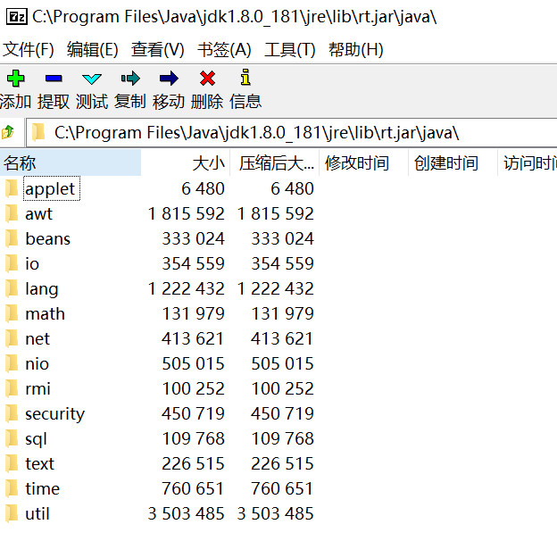

# 虚拟机类加载机制

虚拟机是如何加载class文件呢？
简单来说，虚拟机把class文件加载到内存，并对数据进行验证、转换解析和初始化，最终可以被虚拟机使用

## 类加载的时机

加载、验证、准备、解析、初始化、（使用、卸载）  
加载、验证、准备、初始化是依次开始的

### 加载

* 什么时候加载  
    预加载：在虚拟机启动的加载，加载JAVA_HOME/lib下的class文件    
    
    运行时加载：虚拟机加载.class文件的时候，会去检测类文件有没有被检测过，如果没有则加载
* 加载什么  
    把Class文件-> 虚拟机运行时数据结构
* 怎么加载  
    通过全限定名获取二进制字节流（class文件）    
    （example: 运行时计算生成，使用最多是动态代理技术，java.lang.reflect.Proxy）    
    把class文件转化成元空间数据结构    
    自动生成java.lang.Class对象，作为访问入口  

### 验证

    验证文件格式

### 准备

    为类变量初始化赋值，final常量直接赋值

### 解析

    常量池的符号引用替换成直接引用

### 初始化

    类变量赋值+静态语句块

#### 初始化的主动引用和被动引用

主动引用：有且只有5种必须对类进行初始化

* 遇到new, getstatic, putstatic, invokestatic这4条字节码指令时
* 使用java.lang.reflct包方法对类进行反射调用
* 初始化一个类，父类还没有初始化
* 用户需要指定一个执行的主类，虚拟机先初始化主类
* java.lang.invoke.MethodHandle实例最后的解析结果REF_getStatic, REF_putStatic, REF_invokeStatic的方法句柄，并且句柄对应的类没有进行初始化

被动引用：除主动引用外，所有引用类的方法都不会出发初始化

## 类加载器

