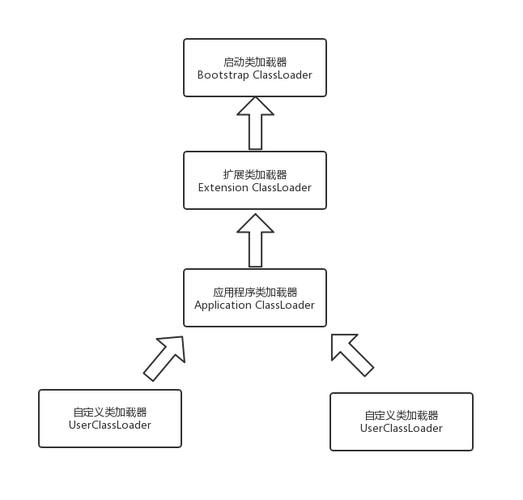

# 虚拟机类加载机制

虚拟机是如何加载class文件呢？
简单来说，虚拟机把class文件加载到内存，并对数据进行验证、转换解析和初始化，最终可以被虚拟机使用

## 类加载的时机

加载、验证、准备、解析、初始化、（使用、卸载）  
加载、验证、准备、初始化是依次开始的

### 加载

* 什么时候加载  
    预加载：在虚拟机启动的加载，加载JAVA_HOME/lib下的class文件    
    
    运行时加载：虚拟机加载.class文件的时候，会去检测类文件有没有被检测过，如果没有则加载
* 加载什么  
    把Class文件-> 虚拟机运行时数据结构
* 怎么加载  
    通过全限定名获取二进制字节流（class文件）  
    （example: 运行时计算生成，使用最多是动态代理技术，java.lang.reflect.Proxy）  
    把class文件转化成元空间数据结构  
    自动生成java.lang.Class对象，作为访问入口  

### 验证

    验证文件格式

### 准备

    为类变量初始化赋值，final常量直接赋值

### 解析

    常量池的符号引用替换成直接引用

### 初始化

    类变量赋值+静态语句块

#### 初始化的主动引用和被动引用

主动引用：有且只有5种必须对类进行初始化

* 遇到new, getstatic, putstatic, invokestatic这4条字节码指令时
* 使用java.lang.reflct包方法对类进行反射调用
* 初始化一个类，父类还没有初始化
* 用户需要指定一个执行的主类，虚拟机先初始化主类
* java.lang.invoke.MethodHandle实例最后的解析结果REF_getStatic, REF_putStatic, REF_invokeStatic的方法句柄，并且句柄对应的类没有进行初始化

被动引用：除主动引用外，所有引用类的方法都不会出发初始化

## 类加载器

执行加载部分
特别注意：判断两个类是否"相等"，需要类加载器和类同时相同

```java
package com.ly.jvmTool;

import java.io.IOException;
import java.io.InputStream;

public class ClassLoaderTest {

    public static void main(String[] args) throws ClassNotFoundException {
        ClassLoader myClassLoader = new ClassLoader() {
            @Override
            public Class<?> loadClass(String name) throws ClassNotFoundException {
                try {
                    String fileName = name.substring(name.lastIndexOf(".") + 1) + ".class";
                    InputStream is = getClass().getResourceAsStream(fileName);
                    if (is == null) {
                        return super.loadClass(name);
                    }
                    byte[] bytes = new byte[is.available()];
                    is.read(bytes);
                    return defineClass(name, bytes, 0, bytes.length);
                } catch (IOException e) {
                    throw new ClassNotFoundException(name);
                }
            }
        };
        Object test = myClassLoader.loadClass("com.ly.jvmTool.ClassLoaderTest");
        System.out.println(test instanceof com.ly.jvmTool.ClassLoaderTest);
    }
}
```

### 双亲委派机制

两种类加载器：启动类加载器(Bootstrap ClassLoader) + 其他类加载器(扩展类加载器，应用程序加载器)  
Bootstrap ClassLoader负责JAVA_HOME/lib
扩展类加载器：JAVA_HOME/lib/ext
应用程序加载器：自定义类
```java
public ClassLoader getClassLoader() {
        ClassLoader cl = getClassLoader0();
        if (cl == null)
            return null;
        SecurityManager sm = System.getSecurityManager();
        if (sm != null) {
            ClassLoader.checkClassLoaderPermission(cl, Reflection.getCallerClass());
        }
        return cl;
    }
```
如果c1 == null, 那么为Bootstrap ClassLoader

#### 类加载器双亲委派模型

层次关系  


双亲委派模型工作过程：

1. 每个类加载器有一个父类加载器，除Bootstrap ClassLoader  
2. 收到类加载请求，优先委托父加载器加载  
3. 当父加载器加载失败，自己会去加载  

### 破坏双亲委托机制

1. eg.JDBC, SPI
2. 热部署
